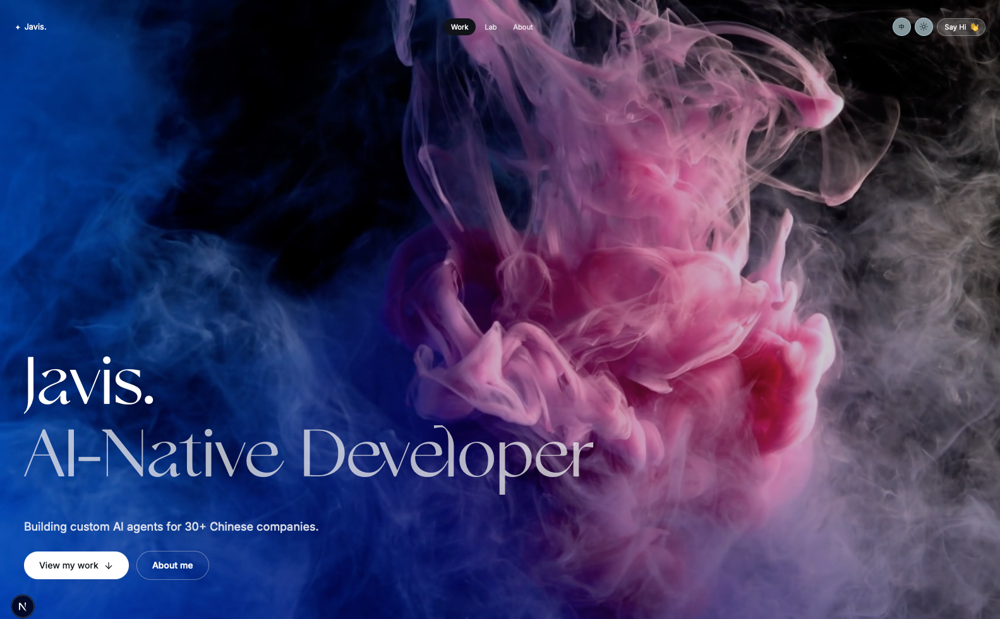

# Build Your Website

一个通过连续上传和问答，生成中英双语个人作品集网站的 Agent Skill。

它使用内置 Next.js 模板固定网站的整体版式、间距、字体角色、导航和滚动动画，再根据用户上传的图片、视频、作品说明、个人介绍与简历，生成可直接运行的网站项目。



## 包含内容

- 按顺序收集身份、首屏素材、Work、Lab、个人介绍、简历、配色与联系方式
- 中英文切换，默认可选择英文或中文
- 图片或视频首屏，支持 16:9 人像素材
- Work 与 Lab 图片/视频卡片的自适应排版
- 五套内置配色和自定义配色
- 可选 Gallery Modern Adobe Web Project、内置 DM Serif Display 回退字体、Inter、Geist Mono 与思源宋体的既定字体角色
- Next.js 网站脚手架、内容校验脚本和视觉 QA 规则

## 使用方法

1. 将整个仓库文件夹或 ZIP 导入支持 `SKILL.md` 的 Agent 工作模式。
2. 调用 `$build-your-website`。
3. 按提示逐步上传资料并回答问题。
4. 确认最终内容简报后生成网站。

不要一次性提交所有资料。这个 Skill 会根据当前已收到的文件，只询问页面仍然缺少的信息。

## 目录

```text
SKILL.md                       Skill 入口和约束
references/                    问答、布局、内容、配色与 QA 规则
assets/palettes.json           五套内置配色
assets/site-template/          Next.js 网站模板
scripts/scaffold.mjs           项目脚手架
scripts/validate-content.mjs   内容校验
```

## 字体说明

Gallery Modern 不以字体文件形式包含在仓库中。需要使用它的网站所有者应提供自己的 Adobe Fonts Web Project 嵌入代码；模板只加载其中的 `https://use.typekit.net/<project-id>.css`。没有提供代码或远程字体加载失败时，网站自动使用内置的 DM Serif Display。

DM Serif Display 与其余开源字体的许可文本保存在 `assets/site-template/public/fonts/`。

## 说明

该 Skill 只借鉴参考网站的版式比例与交互结构，不包含参考网站所有者的个人信息、文案、作品、图片、视频、商标或简历，也不代表与参考网站存在关联。

## License

除单独标注的第三方字体和素材外，本仓库中的原创代码与文档采用 MIT License。
